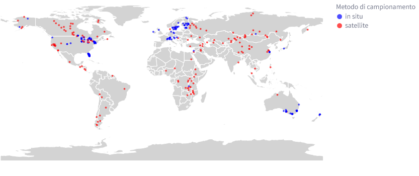

# Lake temperatures

**Lake temperatures è una webapp sviluppata in python con l'utilizzo di *streamlit***

## Progetto

Questo progetto prevede la visualizzazione degli effetti del cambiamento ambientale globale sulle temperature superficiali dei laghi.  
Studi recenti hanno suggerito un riscaldamento significativo delle temperature dell'acqua in laghi individuali
in molte regioni del mondo.  

E' stato assemblato un [database](https://search.dataone.org/view/https%3A%2F%2Fpasta.lternet.edu%2Fpackage%2Fmetadata%2Feml%2Fknb-lter-ntl%2F10001%2F4) delle temperature superficiali estive di 291 laghi,
raccolte in situ e/o tramite satelliti, per il periodo 1985–2009. Inoltre, per ciascun lago sono stati raccolti i relativi fattori
climatici (*temperature dell'aria, radiazione solare e copertura nuvolosa*) e le caratteristiche geomorfometriche (*latitudine, longitudine,
altitudine, superficie del lago, profondità massima, profondità media e volume*) che influenzano le temperature superficiali dei laghi.


## Eseguire l'app

È possibile eseguire l'app in locale tramite:

```bash
git clone https://github.com/lorispivatounipd/PivatoLorisSistemi2.git
uv run streamlit run app.py
```

La webapp è stata testata solamente sul browser Mozilla Firefox, con il tema *Light* e lo zoom della finestra al 100%.
